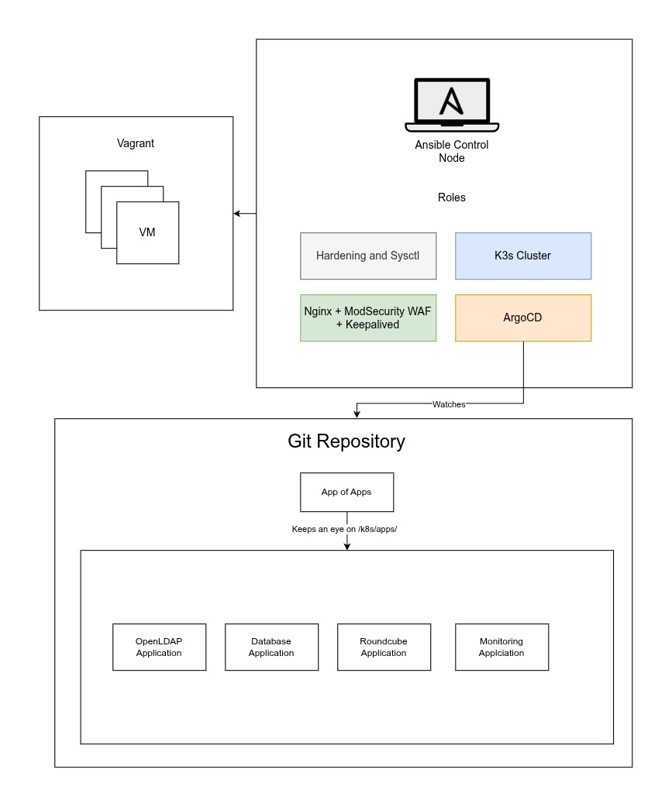
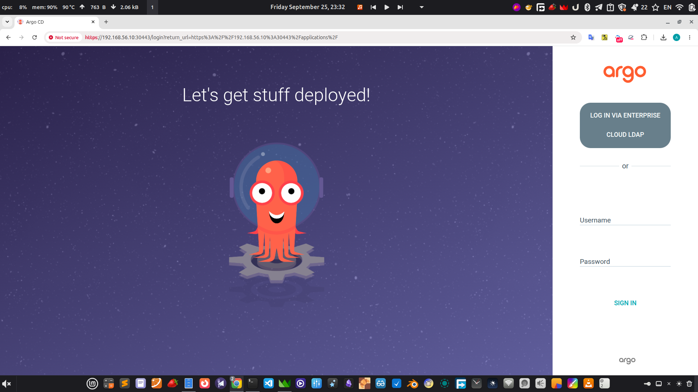
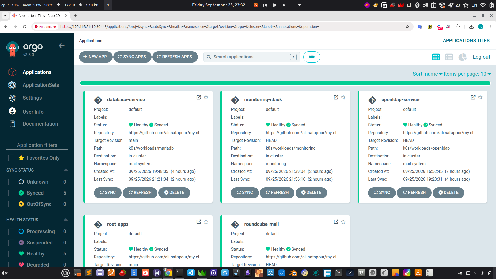
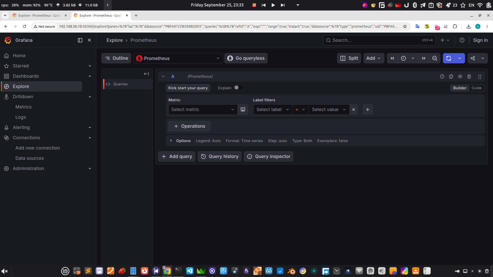
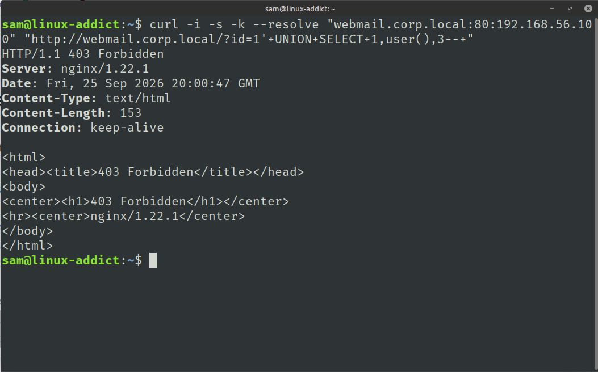
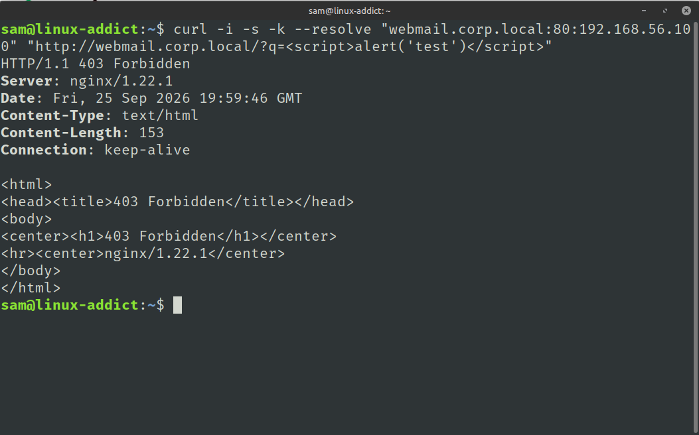

# Enterprise Private Cloud and Webmail Platform

A lightweight, declarative private cloud infrastructure built using GitOps principles. The platform integrates an edge security layer with a containerized cluster hosting directory services, a database, a webmail client, and core monitoring.

---

## Architecture Overview

The system is designed with clear separation of concerns across two primary layers:
1. **Edge Layer:** Handles traffic routing, high availability, and web application firewall (WAF) inspection on the host level.
2. **Cluster Layer:** Runs workloads inside a lightweight K3s cluster, fully managed through ArgoCD.

---

## 1. Network and Traffic Flow

Incoming traffic hits a virtual floating IP managed by Keepalived and passes through Nginx with ModSecurity before reaching the internal workloads. ModSecurity inspects and filters common web attacks (SQLi, XSS) before requests enter the cluster.

## 2. GitOps Delivery Pipeline
The infrastructure and application state are maintained declaratively in Git and deployed using an App-of-Apps pattern.

**Ansible**: Responsible for system setup, network configuration, WAF installation, and cluster bootstrapping.
**ArgoCD**: Monitors the repository and keeps the live cluster state synchronized with the declarative manifests.

---

## 3. Storage and Persistence
Data persistence is managed through the local-path storage provisioner for stateful components.

**Storage Details**
**Stateless Webmail**: Roundcube maintains no local state; all session data and settings are stored in MariaDB.
**Persistent Data**: MariaDB and OpenLDAP volumes are backed directly by host paths through the default storage class.

---

## 4. Screenshots:

